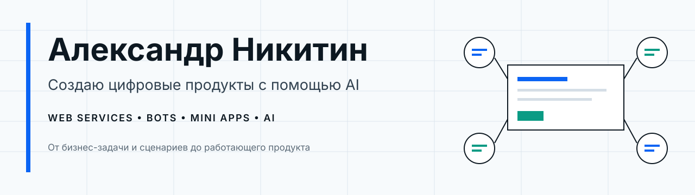
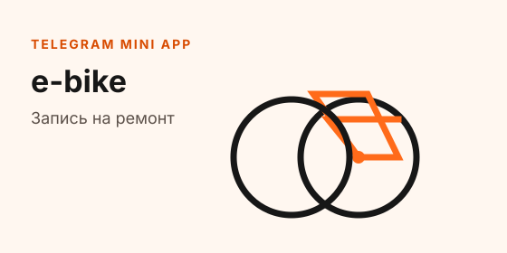
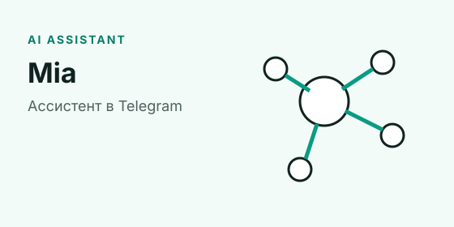
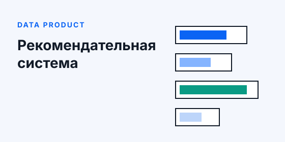
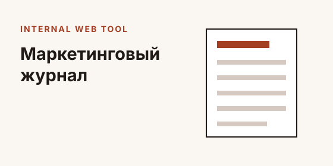

<picture>
  
</picture>

## Привет, я Александр

Создаю веб-сервисы, ботов, Mini Apps и AI-продукты для реальных бизнес задач. Мой основной инструмент - AI-assisted разработка: я проектирую логику и пользовательские сценарии, собираю продукт на подходящем стеке, связываю его с внешними системами и довожу до запуска.

Мне особенно интересны проекты, где нужно не просто написать отдельную функцию, а разобраться в процессе целиком: что должен сделать пользователь, какие данные нужны бизнесу, где могут возникнуть ошибки и как всем этим будут управлять после релиза.

## Избранные проекты

### Система клиентских коммуникаций

Sender и четыре клиентских бота для Telegram и MAX. В одном проекте соединились рассылки, сегментация аудитории, аналитика, управление контентом ботов, программы лояльности и интеграции с 1С и Bitrix24.

**PHP · Vue 3 · Python · aiogram · MAX API · MySQL · 1С · Bitrix24**

[Открыть подробный кейс →](projects/client-communications/README.md)

<table>
  <tr>
    <td width="50%" valign="top">
      
      <h3>e-bike: запись на ремонт</h3>
      
Telegram-бот и Mini App для выбора услуг и времени, управления записями, напоминаний и работы администраторов.

      
<strong>React · FastAPI · aiogram · PostgreSQL</strong>

    </td>
    <td width="50%" valign="top">
      
      <h3>Mia: личный AI-ассистент</h3>
      
Ассистент в Telegram на базе OpenClaw, который превращает диалог с AI в постоянный рабочий инструмент.

      
<strong>AI agents · Telegram · OpenClaw · integrations</strong>

    </td>
  </tr>
  <tr>
    <td width="50%" valign="top">
      
      <h3>Рекомендательная система</h3>
      
Сервис, который подбирает релевантные предложения на основе данных и заданных бизнес-правил.

    </td>
    <td width="50%" valign="top">
      
      <h3>Маркетинговый журнал</h3>
      
Рабочий веб-раздел для ведения маркетинговых активностей внутри корпоративной системы журналов.

    </td>
  </tr>
</table>

## Как я работаю

- Начинаю с задачи и сценария, а не с выбора языка.
- Разбираю процесс на понятные части: интерфейс, данные, интеграции и контроль ошибок.
- Использую AI как рабочую среду разработки, но проверяю результат тестами, статическим анализом и реальными пользовательскими сценариями.
- Могу самостоятельно пройти путь от идеи и прототипа до развернутого продукта.

## С чем работаю

- **Frontend:** Vue, React, TypeScript, JavaScript, Vite
- **Backend:** Python, PHP, FastAPI, REST API, фоновые задачи
- **Боты и AI:** Telegram, MAX, aiogram, OpenClaw, AI agents
- **Данные и интеграции:** MySQL, PostgreSQL, 1С, Bitrix24, внешние API
- **Рабочий процесс:** Git, GitHub Actions, Docker, тесты, статический анализ

## Связаться

Публичные кейсы показывают продукт и мой вклад. Исходный код коммерческих проектов доступен работодателю или заказчику по запросу.

[GitHub](https://github.com/NikkiSandro)
